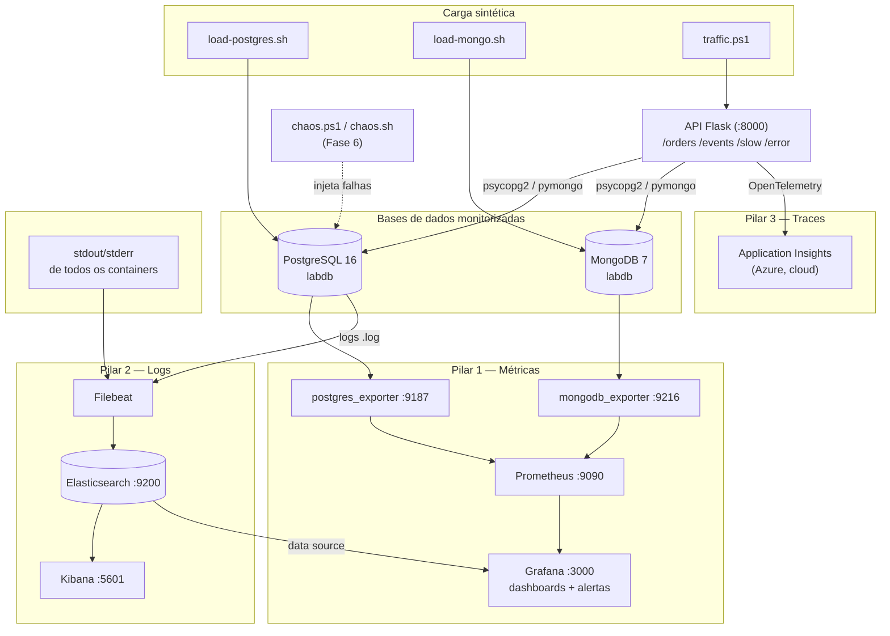
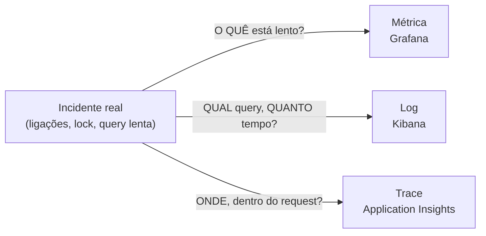
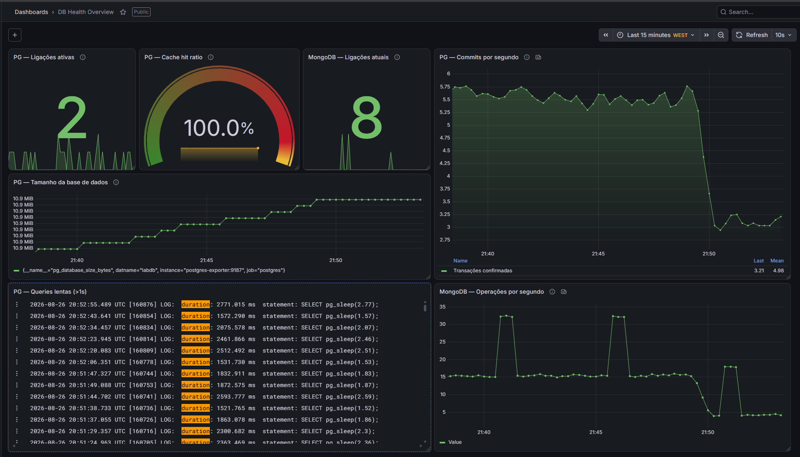

# DB Health Monitor

Laboratório de observabilidade que monitoriza duas bases de dados — uma relacional (**PostgreSQL**) e uma NoSQL (**MongoDB**) — cobrindo os três pilares clássicos: **métricas**, **logs** e **traces**, num ambiente 100% reproduzível com Docker Compose.

O projeto está organizado em 6 fases incrementais, cada uma documentada em detalhe em [`docs/`](docs/) (ver secção [Documentação detalhada](#documentação-detalhada)).

---

## Arquitetura



**Como ler este diagrama:** a carga sintética (load scripts + tráfego HTTP) mantém os gráficos "vivos"; cada base de dados alimenta o seu próprio exporter, que o Prometheus recolhe; o Filebeat lê os logs do PostgreSQL e de todos os containers e envia-os para o Elasticsearch; a API Flask gera traces diretamente para o Application Insights. O Grafana é o único ecrã que junta métricas (Prometheus) e logs (Elasticsearch) no mesmo dashboard. Os scripts de chaos (Fase 6) injetam falhas reais no PostgreSQL para exercitar as três camadas de deteção em simultâneo.

### Os três pilares, lado a lado



### Componentes e portas

| Componente | Função | Porta |
|---|---|---|
| PostgreSQL 16 | Base relacional monitorizada | 5432 |
| MongoDB 7 | Base NoSQL monitorizada | 27017 |
| postgres_exporter | Expõe métricas do PostgreSQL ao Prometheus | 9187 |
| mongodb_exporter (Percona) | Expõe métricas do MongoDB ao Prometheus (esquema `mongodb_ss_*`) | 9216 |
| Prometheus | Recolha e armazenamento de métricas | 9090 |
| Grafana | Dashboards, alertas, e painel de logs (Elasticsearch) | 3000 |
| Elasticsearch 8.13.4 | Armazenamento e pesquisa de logs (data streams `db-logs-*`) | 9200 |
| Kibana 8.13.4 | Exploração de logs | 5601 |
| Filebeat 8.13.4 | Envio de logs (PostgreSQL + containers) | — |
| API Flask (`api/app.py`) | App instrumentada com OpenTelemetry para APM | 8000 |
| Application Insights | Traces distribuídos, Application Map, Failures (Azure, cloud) | — |

---

## Pré-requisitos

- Docker Desktop (Windows: WSL2 com `vm.max_map_count=262144` para o Elasticsearch — ver [fase4-resumo.md](docs/fase4-resumo.md))
- Python 3.10+ (só para a API da Fase 5)
- Conta Azure com um recurso Application Insights (opcional, free tier — ver [fase5-resumo.md](docs/fase5-resumo.md))

## Quick start

```powershell
# 1. Arrancar toda a stack (9 containers)
docker compose up -d
docker compose ps

# 2. Confirmar os targets do Prometheus
start http://localhost:9090/targets

# 3. Aplicar o schema do PostgreSQL
docker cp sql/schema.sql lab-postgres:/tmp/schema.sql
docker exec -it lab-postgres psql -U admin -d labdb -f /tmp/schema.sql

# 4. Arrancar a carga sintética (janelas separadas, Git Bash)
./scripts/load-postgres.sh
./scripts/load-mongo.sh

# 5. (Opcional) Arrancar a API instrumentada com APM
cd api
python -m venv .venv
.\.venv\Scripts\Activate.ps1
pip install -r requirements.txt
$env:APPLICATIONINSIGHTS_CONNECTION_STRING = "<a-tua-connection-string>"
python app.py
cd ..
.\scripts\traffic.ps1

# 6. Abrir o Grafana (admin / admin)
start http://localhost:3000
```

As credenciais neste `docker-compose.yml` (admin/admin123, GF_SECURITY_ADMIN_PASSWORD=admin) são só para uso local do lab — nunca usar fora de `localhost`.

## Estrutura do projeto

```
db-health-monitor/
├── docker-compose.yml              # 9 serviços: postgres, mongodb, exporters, prometheus,
│                                    #   grafana, elasticsearch, kibana, filebeat
├── prometheus/prometheus.yml        # Scrape config dos dois exporters
├── filebeat/filebeat.yml            # Envia logs do PostgreSQL + containers para o ES
├── sql/schema.sql                   # Tabela orders + índice
├── scripts/
│   ├── load-postgres.sh             # Carga sintética SQL (inserts + agregações)
│   ├── load-mongo.sh                # Carga sintética NoSQL (inserts + pipelines)
│   ├── collect-metrics.ps1          # Relatório de saúde via API do Prometheus
│   ├── traffic.ps1                  # Tráfego ponderado contra a API (Fase 5)
│   ├── chaos.ps1 / chaos.sh          # Injeção de falhas controladas (Fase 6)
├── api/
│   ├── app.py                       # API Flask instrumentada com OpenTelemetry
│   └── requirements.txt
├── grafana/dashboards/
│   └── db-health-overview.json      # Dashboard "DB Health Overview" exportado
├── docs/
│   ├── fase{1..6}-conceitos.md      # Conceitos técnicos de cada fase
│   ├── fase{1..6}-resumo.md         # O que foi feito, comandos, troubleshooting real
│   └── fase6-guiao-demo.md          # Guião pronto para apresentar a demo de incidentes
└── README.md
```

## Dashboards e alertas

- Dashboards da comunidade importados: **9628** (PostgreSQL) e **2583** (MongoDB)
- Dashboard próprio **"DB Health Overview"** (7 painéis): ligações ativas, commits/s, cache hit ratio, operações/s MongoDB, ligações MongoDB, tamanho da BD, e um painel de logs (queries lentas) — versionado em `grafana/dashboards/db-health-overview.json`
- Alerta **"PG - Ligacoes elevadas"**: dispara quando as ligações ativas do PostgreSQL excedem 40, com pending period de 2 min (evita falsos positivos por picos momentâneos); ciclo Normal → Pending → Firing → Normal testado com a tempestade de ligações da Fase 3/6

Para reimportar o dashboard: Grafana → Dashboards → New → Import → Upload de `grafana/dashboards/db-health-overview.json`.



## Log aggregation

O PostgreSQL corre com `log_min_duration_statement=1000` — toda query mais lenta que 1s fica registada. O Filebeat envia esses logs, mais o stdout/stderr de todos os containers, para o Elasticsearch (data streams `db-logs-*`), pesquisáveis no Kibana ou diretamente num painel do Grafana. Detalhe de implementação relevante: os campos personalizados usam `service.name` (não `service`), para não colidir com o esquema ECS do Elasticsearch — ver [fase4-conceitos.md](docs/fase4-conceitos.md#2-ecs-elastic-common-schema-e-o-conflito-do-campo-service).

## APM / traces (Fase 5)

A API Flask (`api/app.py`) expõe endpoints que consultam as duas bases, mais um `/slow` (deliberadamente lento) e um `/error` (falha ~50% das vezes). Instrumentada com a distro `azure-monitor-opentelemetry`, com instrumentação **explícita** de Flask e PyMongo (a descoberta automática da distro não os ativava de forma fiável — ver [fase5-conceitos.md](docs/fase5-conceitos.md#2-distros-de-opentelemetry-e-o-modelo-de-auto-instrumentação)). Produz um Application Map com PostgreSQL e MongoDB como dependências, e permite fazer drill-down num trace individual para ver exatamente onde o tempo foi gasto.

```powershell
cd api
pip install -r requirements.txt
$env:APPLICATIONINSIGHTS_CONNECTION_STRING = "<a-tua-connection-string>"
python app.py
```

## Demo de incidentes (Fase 6)

O `chaos.ps1`/`chaos.sh` injeta 3 falhas controladas para exercitar as três camadas de deteção em conjunto:

```powershell
.\scripts\chaos.ps1 connections   # tempestade de 50 ligações -> alerta no Grafana
.\scripts\chaos.ps1 slowquery     # CROSS JOIN pesado -> log no Kibana + trace no App Insights
.\scripts\chaos.ps1 lock          # lock ACCESS EXCLUSIVE -> commits/s em flatline
.\scripts\chaos.ps1 status        # diagnóstico via pg_stat_activity
.\scripts\chaos.ps1 resolve       # termina as sessões problemáticas
```

O guião completo, minuto a minuto, com as falas e os 8 screenshots sugeridos, está em [docs/fase6-guiao-demo.md](docs/fase6-guiao-demo.md).

## Documentação detalhada

Cada fase tem dois documentos: `conceitos.md` (o "porquê" teórico) e `resumo.md` (o "como foi feito", com os problemas reais encontrados e resolvidos):

| Fase | Conteúdo | Conceitos | Resumo |
|---|---|---|---|
| 1 | Infraestrutura base (exporters, healthchecks) | [fase1-conceitos.md](docs/fase1-conceitos.md) | [fase1-resumo.md](docs/fase1-resumo.md) |
| 2 | Scripts de carga sintética | [fase2-conceitos.md](docs/fase2-conceitos.md) | [fase2-resumo.md](docs/fase2-resumo.md) |
| 3 | Dashboards e alertas no Grafana | [fase3-conceitos.md](docs/fase3-conceitos.md) | [fase3-resumo.md](docs/fase3-resumo.md) |
| 4 | Log aggregation (Elasticsearch/Kibana/Filebeat) | [fase4-conceitos.md](docs/fase4-conceitos.md) | [fase4-resumo.md](docs/fase4-resumo.md) |
| 5 | APM com Application Insights | [fase5-conceitos.md](docs/fase5-conceitos.md) | [fase5-resumo.md](docs/fase5-resumo.md) |
| 6 | Demo de incidentes | [fase6-conceitos.md](docs/fase6-conceitos.md) | [fase6-resumo.md](docs/fase6-resumo.md) · [guião](docs/fase6-guiao-demo.md) |

Também: [versoes-tecnologias.md](docs/versoes-tecnologias.md) — versões exatas de cada componente da stack (confirmadas nos serviços em execução, não só nas tags do `docker-compose.yml`).

## Custos

Tudo nesta stack é gratuito para uso local: PostgreSQL, MongoDB, Prometheus, Grafana OSS, os exporters e o Filebeat são open source; Elasticsearch e Kibana correm sob a licença Basic gratuita; o Application Insights fica dentro do free tier de ingestão da Azure (5 GB/mês) para este volume de tráfego.

## Roadmap / extensões possíveis

- Notificações de alerta via Discord/Slack (contact point)
- Node exporter para métricas ao nível do host
- Grafana provisioning (dashboards e data sources como código)
- Screenshots e vídeo da demo de incidentes no README
- Dynatrace OneAgent como alternativa de APM (trial de 15 dias) — comparação *agent-based vs SDK-based instrumentation*

## Licença

MIT
