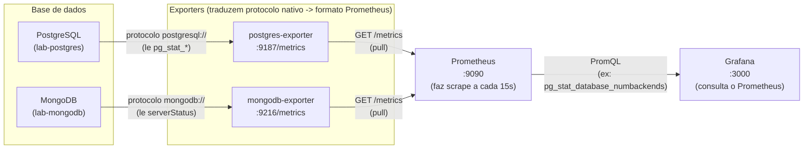
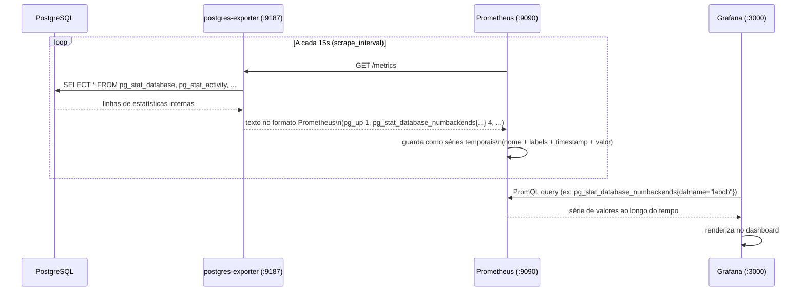
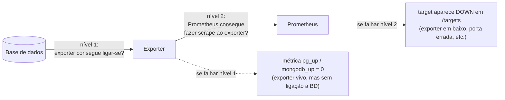

# Fase 1 — Conceitos técnicos e teóricos

Este documento explica os conceitos por trás das ferramentas e decisões da Fase 1, complementando o "como fazer" já coberto em [fase1-resumo.md](fase1-resumo.md).

---

## 1. Containers e Docker

**Container** — um processo isolado que corre com o seu próprio filesystem, rede e espaço de processos, mas partilha o kernel do sistema operativo host (ao contrário de uma máquina virtual, que emula hardware completo). É por isso que um container arranca em segundos e uma VM demora minutos.

**Imagem vs. container** — a imagem (`postgres:16`, `mongo:7`) é o "molde" imutável (filesystem + metadados); o container é uma instância em execução dessa imagem, com uma camada de escrita própria por cima.

**Porque fixar a versão da imagem (`postgres:16` em vez de `postgres:latest`)** — `latest` pode mudar de conteúdo entre pulls, tornando o ambiente não-reprodutível. Fixar a versão garante que o mesmo `docker-compose.yml` produz sempre o mesmo resultado, hoje ou dentro de um ano.

## 2. Docker Compose e orquestração declarativa

O `docker-compose.yml` é uma definição **declarativa**: descreve o estado desejado (que serviços existem, como se ligam, que portas expõem) e o Compose encarrega-se de criar a rede, os volumes e a ordem de arranque — em vez de teres de correr manualmente 6 comandos `docker run` com todas as flags.

**Rede interna e resolução de nomes (DNS de serviço)** — o Compose cria automaticamente uma rede virtual onde cada serviço é acessível pelo seu nome (`postgres`, `mongodb`, `postgres-exporter`, ...). É por isto que o `DATA_SOURCE_NAME` do exporter usa `postgres:5432` e não `localhost:5432` — dentro da rede do Compose, `localhost` refere-se ao próprio container, não ao host nem a outros serviços. Este é o erro mais comum de quem começa com Compose.

**`depends_on` com `condition: service_healthy`** — por defeito, `depends_on` só espera que o container tenha *arrancado*, não que esteja *pronto* a aceitar ligações (um Postgres pode levar alguns segundos a inicializar a base de dados antes de aceitar queries). Ao condicionar a `service_healthy`, o Compose só arranca o exporter depois do healthcheck do Postgres/Mongo passar — evita a classe de erros "connection refused no arranque".

**Healthcheck** — um comando que o Docker corre periodicamente dentro do container (`pg_isready`, `mongosh ... ping`) para decidir se o serviço está `healthy`, `unhealthy` ou `starting`. É o mecanismo que torna a orquestração fiável em vez de depender de esperas arbitrárias.

## 3. Persistência de dados — volumes

Um container é efémero: se for destruído (`docker compose down`), tudo o que foi escrito no seu filesystem desaparece. Os **volumes nomeados** (`pgdata`, `mongodata`, `pglogs`) são geridos pelo Docker fora do ciclo de vida do container — sobrevivem a `docker compose down` (mas não a `down -v`, que os apaga explicitamente).

- `pgdata` → ficheiros de dados do PostgreSQL (`/var/lib/postgresql/data`).
- `mongodata` → ficheiros de dados do MongoDB (`/data/db`).
- `pglogs` → logs de queries lentas, preparados para a Fase 4 (Filebeat vai ler daqui).

**Bind mount vs. volume nomeado** — o `prometheus.yml` usa um *bind mount* (`./prometheus/prometheus.yml:/etc/prometheus/...`), que liga um caminho concreto do host ao container — ideal para ficheiros de configuração que queres editar localmente e ver refletidos (após restart). Os volumes nomeados são geridos pelo Docker e mais indicados para dados que não precisas de tocar diretamente.

## 4. Observabilidade — os três pilares

Este projeto no seu todo cobre os três pilares clássicos de observabilidade:

| Pilar | Responde a | Ferramenta na Fase 1 |
|---|---|---|
| **Métricas** | "O que está a acontecer, agregado ao longo do tempo?" (ex.: nº de ligações, taxa de commits) | Prometheus + exporters |
| **Logs** | "O que aconteceu exatamente, evento a evento?" | (Filebeat + Elasticsearch — Fase 4) |
| **Traces** | "Por onde passou este pedido específico, e onde perdeu tempo?" | (Application Insights — fase de APM) |

A Fase 1 estabelece a base do pilar de **métricas**.

## 5. Prometheus — modelo de séries temporais e scraping

**Pull vs. push** — ao contrário de sistemas que recebem métricas enviadas pelas aplicações (push), o Prometheus funciona por **scraping**: visita periodicamente (`scrape_interval: 15s`) um endpoint HTTP `/metrics` de cada alvo e recolhe o estado atual. Isto simplifica a arquitetura (os alvos não precisam de saber nada sobre o Prometheus) e torna trivial detetar se um alvo está em baixo (falha no scrape).

**Séries temporais e labels** — cada métrica é identificada por um nome mais um conjunto de pares chave-valor (labels), ex.: `pg_stat_database_numbackends{datname="labdb"}`. O `job_name` no `prometheus.yml` torna-se automaticamente o label `job`, permitindo filtrar métricas por origem (`up{job="postgres"}`).

**A métrica `up`** — gerada automaticamente pelo Prometheus para cada alvo (1 = scrape teve sucesso, 0 = falhou). É a métrica mais básica de "está vivo?" e a primeira coisa a verificar quando algo não aparece num dashboard.

## 6. Exporters — a ponte entre a base de dados e o Prometheus

O PostgreSQL e o MongoDB não falam nativamente o formato de métricas do Prometheus. Um **exporter** é um processo intermediário que:

1. Liga-se à base de dados usando o protocolo nativo dela (`postgresql://...`, `mongodb://...`).
2. Lê estatísticas internas (no Postgres, as views `pg_stat_*`; no Mongo, o resultado de comandos como `serverStatus`).
3. Expõe essas estatísticas num endpoint HTTP `/metrics`, no formato de texto que o Prometheus entende (`nome_da_metrica valor`).

Isto explica a métrica `pg_up` / `mongodb_up`: é o próprio exporter a reportar se **ele** conseguiu falar com a base de dados — distinto do `up{job=...}` do Prometheus, que reporta se o Prometheus conseguiu falar com **o exporter**. Existem por isso dois níveis de falha possíveis na cadeia BD → exporter → Prometheus, e o Passo 5 do guia valida-os separadamente.

### Diagrama — arquitetura geral (BD → exporter → Prometheus → Grafana)

### Diagrama — ciclo de vida de um scrape (pull model)

### Diagrama — os dois níveis de falha na cadeia

## 7. `log_min_duration_statement` — a base da deteção de queries lentas

Esta configuração do PostgreSQL instrui o motor a escrever no log qualquer query cuja execução exceda o limiar (aqui, 1000 ms), sem registar as restantes (`log_statement=none`). É uma técnica de amostragem por limiar: em produção evita inundar os logs com ruído, mas garante que os outliers de performance (exatamente os que interessam numa investigação de incidente) ficam capturados. Vai ser a fonte de dados da deteção de queries lentas na Fase 4.

## 8. Grafana — camada de visualização, não de armazenamento

O Grafana não armazena métricas — é um cliente que interroga fontes de dados (aqui, o Prometheus) através da sua API de queries e renderiza os resultados. É por isso que a ligação Grafana → Prometheus tem de usar o nome do serviço na rede do Compose (`http://prometheus:9090`), pela mesma razão de resolução de nomes explicada na secção 2: o Grafana corre no seu próprio container.

## 9. Reprodutibilidade como princípio de desenho

Vários detalhes da Fase 1 seguem o mesmo princípio subjacente — tornar o ambiente **reprodutível**:

- Versões de imagem fixas (evita drift entre execuções).
- Configuração como código (`docker-compose.yml`, `prometheus.yml` versionados em Git, em vez de configurados manualmente na UI).
- Healthchecks em vez de esperas fixas (o arranque adapta-se à velocidade real de cada serviço, não a um tempo de espera arbitrário).

É o mesmo princípio que torna possível a alguém clonar o repositório, correr `docker compose up -d` e obter exatamente o mesmo ambiente de observabilidade — sem passos manuais escondidos.

---

**Ver também:** [fase1-resumo.md](fase1-resumo.md) — comandos e resultados de validação executados nesta fase.
