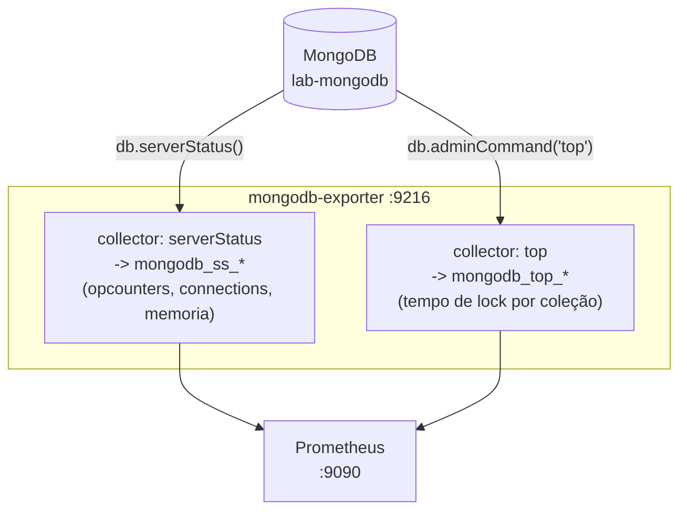

# Fase 2 — Conceitos técnicos e teóricos

Este documento explica os conceitos por trás das ferramentas e decisões da Fase 2, complementando o "como fazer" em [fase2-resumo.md](fase2-resumo.md). Ver também [fase1-conceitos.md](fase1-conceitos.md) para os fundamentos de containers/Prometheus/exporters já estabelecidos.

---

## 1. Carga sintética como ferramenta de observabilidade

Uma stack de monitorização vazia (sem tráfego) não ensina nada — todos os gráficos são linhas planas a zero. **Carga sintética** (scripts que simulam uso real) é o que transforma a infraestrutura da Fase 1 num laboratório vivo: sem ela, não há commits/s para ver, não há ligações a oscilar, não há queries lentas para detetar.

Os três "níveis" de operação no `load-postgres.sh` (insert simples / agregação periódica / update em lote) não são arbitrários — simulam padrões de carga distintos que se traduzem em sinais diferentes nas métricas:

| Padrão de carga | Efeito nas métricas |
|---|---|
| INSERT constante | `rate(xact_commit)` estável, uma linha "batimento cardíaco" |
| Agregação periódica (`GROUP BY`) | Picos de leitura (`blks_read`/`blks_hit`), CPU |
| UPDATE em lote | Picos de escrita, mais WAL gerado, possíveis locks |

## 2. `RANDOM` e geração de dados pseudo-aleatórios em Bash

`$RANDOM` é uma variável especial do Bash (não um comando) que devolve um inteiro pseudo-aleatório entre 0 e 32767 a cada leitura. `$((RANDOM % 1000))` usa o operador de resto (`%`) para "encaixar" esse valor num intervalo menor (0–999) — a técnica padrão para gerar números aleatórios limitados em Bash, já que não há um equivalente direto a `Math.random()`.

No script do Mongo, o mesmo objetivo é atingido do lado do **JavaScript embutido no `mongosh --eval`**, com `Math.random()` e `Math.floor()` — uma pista de que o `mongosh` corre um motor JS completo, não é apenas um cliente de comandos.

## 3. `set -euo pipefail` — disciplina de scripts Bash "a sério"

Esta linha, presente em ambos os scripts `.sh`, ativa três comportamentos que não são o default do Bash:

- **`-e`** — o script pára imediatamente se qualquer comando falhar (código de saída ≠ 0), em vez de continuar a correr com um erro ignorado.
- **`-u`** — referenciar uma variável não definida é um erro fatal, em vez de silenciosamente valer string vazia (protege contra erros de digitação em nomes de variáveis).
- **`-o pipefail`** — numa cadeia `a | b | c`, o exit code reflete a primeira falha em qualquer parte do pipe, não só o último comando (por defeito, o Bash só olha para o exit code do último).

Sem isto, um erro no meio do loop `while true` podia passar despercebido indefinidamente.

## 4. `trap ... INT` — terminação controlada

Um loop `while true; do ... done` corre para sempre até ser interrompido. `trap 'comando' INT` regista um "handler" para o sinal `SIGINT` (o que o `Ctrl+C` envia), permitindo correr um bloco de limpeza/resumo (`echo "Total: $ITER iteracoes"`) antes de terminar de forma controlada (`exit 0`), em vez de o script morrer abruptamente a meio de uma operação.

## 5. Injeção de SQL nos scripts de carga — um risco aceite conscientemente

Os scripts constroem strings SQL por interpolação direta (`"INSERT INTO orders (...) VALUES ($customer, $amount, ...)"`), o que **seria uma vulnerabilidade de SQL injection num contexto de produção** com input de utilizador. Aqui é aceitável porque os valores (`customer`, `amount`) são gerados internamente pelo próprio script a partir de `$RANDOM`, nunca de input externo — mas é um bom ponto de discussão de portfólio: a diferença entre "código de laboratório" e "código para produção" está exatamente em quem controla os valores que entram na query.

## 6. Terminais diferentes, propósitos diferentes (PowerShell vs. Git Bash)

Esta fase tornou explícito algo que a Fase 1 só tocou de raspão: **PowerShell e Git Bash são dois ambientes de execução distintos**, cada um interpretando comandos à sua maneira:

- `chmod`, `./script.sh`, `$RANDOM`, `trap` — só existem/funcionam em Bash.
- `.ps1`, `Invoke-RestMethod`, `Get-ExecutionPolicy` — só existem em PowerShell.
- Tentar correr um `.ps1` no Git Bash devolve `command not found`; tentar correr `chmod` no PowerShell devolve `CommandNotFoundException`. Não é um erro de instalação — é o shell errado para o tipo de script.

Isto reflete uma decisão real de desenho do projeto: usar Bash para os scripts de carga (mais natural para chamadas repetidas a `psql`/`mongosh`) e PowerShell para o relatório de saúde (mais natural para consumir uma API REST e formatar output tabular) — e por isso é preciso alternar entre dois terminais durante esta fase.

## 7. `docker exec -i` e o problema de piping no Windows

A tentativa inicial de aplicar o schema com `Get-Content .\sql\schema.sql | docker exec -i lab-postgres psql ...` falhou silenciosamente. A causa raiz é a forma como o PowerShell serializa a pipeline para um processo nativo externo: o `Invoke-RestMethod`/pipeline do PowerShell não garante que o stdin chega ao processo filho (`docker exec`) da mesma forma "contínua" que um pipe nativo do Bash/Unix garantiria — o buffering e o fecho do stream podem não se comportar como esperado.

**Padrão mais fiável em Windows:** em vez de "empurrar" conteúdo via stdin para dentro do container, **copiar o ficheiro para dentro do container** (`docker cp`) e pedir ao processo lá dentro para o ler do disco (`psql -f /tmp/schema.sql`). Isto evita depender do comportamento de piping entre dois sistemas de shell diferentes (PowerShell → processo Linux dentro do container).

## 8. `serverStatus` vs. "top" — duas fontes de métricas do MongoDB

Descobrimos, ao investigar porque `mongodb_op_counters_total` não existia, que o `mongodb_exporter` (percona) pode obter métricas de **fontes diferentes** dentro do MongoDB, cada uma com o seu prefixo:

- **`mongodb_ss_*`** (de `serverStatus`) — estatísticas globais do servidor: operações totais por tipo (`opcounters`), ligações (`connections`), memória, etc. É o equivalente a "como está o servidor no seu todo".
- **`mongodb_top_*`** (do comando `top` do MongoDB) — estatísticas **por coleção**: tempo total gasto em operações de leitura/escrita nessa coleção especificamente (`mongodb_top_writeLock_time`, `mongodb_top_total_count`). É o equivalente a "onde está o tempo a ser gasto, coleção a coleção".

Isto explica por que, ao filtrar `/metrics` por "connections", apareceram só linhas com "collection" (correspondência textual coincidente, não a métrica procurada) — os dois conceitos de "serverStatus" e "top" produzem famílias de métricas com propósitos e nomenclaturas distintas, e um exporter pode ter alguns collectors ativos e outros não, dependendo de flags de arranque.

### Diagrama — duas fontes de métricas dentro do mesmo exporter

## 9. Versionamento de ferramentas de terceiros e "drift" de nomenclatura

O guia original assumia nomes de métrica (`mongodb_op_counters_total`) que não correspondem à versão do exporter realmente usada (`percona/mongodb_exporter:0.40`). Isto ilustra um problema comum em stacks de observabilidade open-source: **exporters e agentes de terceiros mudam nomes de métricas entre versões major** (não é incomum um exporter reescrever completamente o seu esquema de naming numa major version, como aconteceu com o `mongodb_exporter` ao passar de uma arquitetura legacy — flag `--collect-all`, tudo com prefixo `mongodb_ss_` — para uma arquitetura modular por collector).

**Consequência prática:** ao fixar uma versão de imagem (Fase 1, secção de reprodutibilidade), fixas também o *contrato de métricas* que vais consumir nos teus dashboards e alertas — mudar a versão do exporter mais tarde pode silenciosamente partir dashboards que dependiam de nomes antigos. É por isso que se valida sempre com `/metrics` diretamente, em vez de confiar de olhos fechados na documentação ou num guia genérico.

---

**Ver também:** [fase2-resumo.md](fase2-resumo.md) — comandos, resultados e troubleshooting real desta fase.
