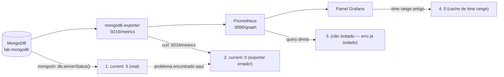

# Fase 3 — Conceitos técnicos e teóricos

Este documento explica os conceitos por trás das ferramentas e decisões da Fase 3, complementando o "como fazer" em [fase3-resumo.md](fase3-resumo.md). Ver também [fase2-conceitos.md](fase2-conceitos.md) — em particular a secção sobre `mongodb_ss_*` vs. `mongodb_top_*` — para os fundamentos de nomenclatura de métricas do MongoDB já estabelecidos.

---

## 1. Métricas com label vs. métricas com nome-por-tipo

O `mongodb_ss_opcounters` e o `mongodb_ss_connections` seguem um padrão comum em Prometheus: **uma métrica, várias séries, distinguidas por um label** (`type="insert"`, `conn_type="current"`), em vez de uma métrica separada por tipo (`mongodb_opcounters_insert`, `mongodb_opcounters_query`, ...).

Isto tem uma consequência direta em PromQL: para obter "uma linha por tipo" num gráfico, usa-se `sum by (<label>) (...)` — a agregação `sum` colapsa todas as *outras* labels (instância, job, etc.), mas o `by (<label>)` preserva exatamente a dimensão que se quer manter separada. Sem o `by`, `sum(...)` daria uma única linha com o total de todos os tipos juntos — tecnicamente correto, mas inútil para comparar padrões de operação.

Este é o mesmo mecanismo, aplicado a um caso concreto, do padrão já introduzido na Fase 2 com `sum by (type) (rate(mongodb_op_counters_total[1m]))` — só que aqui a métrica de base tinha um nome diferente do esperado, o que obrigou a descobrir o label correto por tentativa (`Explore` → autocomplete de labels) em vez de assumir a documentação genérica do guia.

## 2. `active` vs. `current`: a diferença entre uma fotografia instantânea e um estado persistente

Ao investigar o Painel 5, a métrica `conn_type="active"` devolveu `0` — um valor **correto**, mas que não respondia à pergunta pretendida ("quantas ligações estão abertas?"). A distinção:

- **`current`** — quantas ligações TCP estão **abertas** neste momento (um contador de estado, sobe e desce lentamente, à medida que clientes se ligam/desligam).
- **`active`** — quantas dessas ligações estão, **neste milissegundo exato**, a executar uma operação (não em espera). Como a maior parte do tempo de vida de uma ligação é passado "idle" à espera do próximo pedido, é normal e esperado que `active` seja `0` na maioria dos scrapes, mesmo com tráfego real a acontecer — só sobe durante os picos de execução efetiva.

A lição generaliza-se: ao escolher uma métrica para um painel, a pergunta certa não é só "esta métrica existe e tem valores?", mas "esta métrica mede exatamente o conceito que quero mostrar, ou mede algo relacionado mas diferente?". Duas métricas podem estar ambas "corretas" e ainda assim responder a perguntas diferentes.

## 3. Depuração em camadas: isolar onde os dados se perdem

O Painel 5 continuou a mostrar `0` mesmo depois de corrigido o label (`current`). A investigação seguiu uma disciplina explícita de **testar cada camada isoladamente**, da fonte de dados para a apresentação:

Cada camada tem uma ferramenta de verificação própria, independente das restantes:

| Camada | Como testar isoladamente | O que confirma |
|---|---|---|
| Base de dados | `mongosh --eval "db.serverStatus()..."` | O dado real existe na fonte |
| Exporter | `curl http://localhost:9216/metrics \| grep ...` | O exporter está a traduzir/expor corretamente |
| Prometheus | Query direta em `:9090/graph` | O scrape chegou e foi armazenado |
| Grafana | O próprio painel/Explore, com atenção ao time range | A apresentação está a consultar a janela de tempo certa |

Sem isolar as camadas, um "No data" (ou um valor errado) tende a ser atribuído à camada mais visível (o painel), quando a causa raiz pode estar duas ou três camadas mais a montante — como aconteceu aqui, em que o problema real estava no *exporter*, não no Prometheus nem no Grafana.

## 4. Exporters ficam "presos" depois de uma falha de ligação

Os logs do `lab-mongo-exporter` mostraram um erro de DNS (`lookup mongodb ... no such host`) várias vezes ao longo de dois dias, seguido de longos períodos sem novos erros — sugerindo que a ligação eventualmente teve sucesso. No entanto, a métrica `connections` continuou a reportar `0` até um `docker restart` explícito.

**Interpretação:** muitos exporters mantêm uma sessão/ligação persistente ao alvo (MongoDB, neste caso) e só a recriam em circunstâncias específicas. Se a ligação inicial falha mas o processo do exporter não morre (só regista o erro e continua a servir `/metrics` com o último estado conhecido, ou com zeros por falta de dados), o resultado é um exporter "vivo" na aparência (responde na porta, o Prometheus consegue fazer scrape com sucesso) mas a reportar dados obsoletos ou vazios indefinidamente — sem qualquer sinal de erro visível fora dos seus próprios logs.

**Consequência prática:** `docker logs <exporter>` deve ser um dos primeiros sítios a verificar quando um exporter "funciona" (responde, está `Up`, o Prometheus marca o target como `UP`) mas os dados não fazem sentido — a saúde de um target no Prometheus (`up == 1`) só confirma que o *scrape HTTP* teve sucesso, não que o exporter conseguiu falar com o sistema que está a monitorizar.

## 5. DNS interno do Docker Compose e falhas transitórias de arranque

O nome de serviço `mongodb` (definido no `docker-compose.yml`) devia resolver automaticamente na rede interna criada pelo Compose — e, de facto, resolve na maioria das vezes. As falhas observadas (`lookup mongodb on 127.0.0.11:53: no such host`) são compatíveis com uma janela de arranque em que o DNS embutido do Docker (`127.0.0.11`) ainda não tinha o registo pronto, apesar de `depends_on: condition: service_healthy` já ter sido satisfeito.

Isto ilustra um limite real do `depends_on`/`healthcheck`: garantem que o *serviço dependido* está saudável, mas não garantem que a *rede/DNS* já propagou esse estado para todos os outros containers no exato instante em que eles tentam ligar-se — sobretudo em arranques simultâneos ou reinícios rápidos. Na prática, exporters e clientes que se ligam a serviços por nome devem tolerar (ou pelo menos registar de forma visível) falhas de ligação iniciais, em vez de assumir que o primeiro `dial` tem sempre sucesso.

## 6. Unified Alerting do Grafana: Reduce+Threshold vs. UI simplificada

O modelo conceptual do "unified alerting" do Grafana separa sempre três responsabilidades:

1. **Query** — obter dados (uma série ao longo do tempo, ou um valor instantâneo)
2. **Reduce** — colapsar essa série a um único número (ex.: `Last`, `Max`, `Avg`)
3. **Threshold** — comparar esse número com uma condição (`IS ABOVE`, `IS BELOW`, etc.) para produzir um booleano (dispara / não dispara)

Versões mais recentes do Grafana **simplificam a UI** quando a query já é do tipo `Instant` (devolve diretamente um valor único por série, sem histórico) — nesse caso, o passo "Reduce" é implícito (não há série para reduzir, já é um escalar) e a interface mostra só uma caixa combinada "Alert condition" (`WHEN QUERY IS ABOVE X`). Os blocos explícitos A/B/C só aparecem ao ativar "Advanced options", tipicamente necessário quando se quer combinar múltiplas queries ou aplicar uma função de redução diferente de "usar o valor instantâneo".

**Consequência prática:** um guia escrito para uma versão do Grafana pode descrever uma UI com passos que não existem literalmente noutra versão — o modelo conceptual (query → reduce → threshold) mantém-se, mas a forma como é exposto visualmente pode variar, e vale a pena reconhecer o padrão por trás da UI, não memorizar cliques.

## 7. Pending period: o mecanismo anti-flapping

Uma condição de alerta booleana (`numbackends > 40`) pode oscilar rapidamente à volta do limiar por ruído momentâneo (um pico de 2 segundos, uma query pesada isolada). Sem amortecimento, isto produziria alertas "flapping" — a disparar e resolver repetidamente em segundos, inúteis para qualquer processo de resposta a incidentes.

O **pending period** resolve isto ao exigir que a condição seja verdadeira de forma **contínua** durante um intervalo mínimo (aqui, 2 minutos, avaliado a cada 1 minuto) antes de o estado passar de `Pending` para `Firing`. Isto introduz uma troca consciente: **latência de deteção** (o alerta demora mais a disparar) em troca de **sinal mais limpo** (menos falsos positivos por ruído transitório). O valor certo do pending period depende do que se está a medir — métricas ruidosas por natureza (latência de rede, filas) tendem a precisar de janelas maiores do que métricas mais estáveis.

## 8. Estado do alerta ≠ entrega de notificação

O ciclo Normal → Pending → Firing → Normal é inteiramente interno ao motor de alerting do Grafana e **não depende de nenhum contact point configurado**. Um alerta pode ficar `Firing` indefinidamente, visível na UI, sem que ninguém seja notificado — a entrega (email, Discord, Slack, PagerDuty, ...) é uma camada adicional e desacoplada, configurada separadamente via **Notification policies** e **Contact points**.

Isto é uma separação de responsabilidades deliberada e comum em sistemas de alerting: a *avaliação* da condição (é verdade ou não?) é independente da *notificação* (quem precisa de saber, e como?). Para um laboratório, a avaliação por si só já é suficiente para demonstrar o ciclo completo; para produção, a ausência de um contact point funcional seria, na prática, um alerta "mudo" — tecnicamente correto mas operacionalmente inútil.

## 9. Dashboards como estado efémero vs. "dashboards as code"

Um dashboard construído manualmente na UI do Grafana vive dentro do volume de dados do container (`grafana-data` ou equivalente) — `docker compose down -v` destrói-o irrecuperavelmente. A exportação para JSON (**Export as JSON**, distinto de **Share externally**, que cria um link público em vez de um ficheiro) transforma esse estado efémero num artefacto versionável em Git, tal como código.

Isto é um primeiro passo, manual, na direção do conceito de **"dashboards as code"**: o objetivo final (mencionado como próximo passo no roadmap) é o *provisioning* — o Grafana carrega dashboards e data sources automaticamente a partir de ficheiros YAML/JSON montados no arranque do container, eliminando por completo a necessidade de reconstruir manualmente um dashboard depois de qualquer perda de estado. O export manual feito nesta fase é o equivalente a "guardar um `git commit` do estado atual à mão"; o provisioning seria o equivalente a "o estado desejado já está no repositório, o container só o aplica".

---

**Ver também:** [fase3-resumo.md](fase3-resumo.md) — comandos, resultados e troubleshooting real desta fase.
