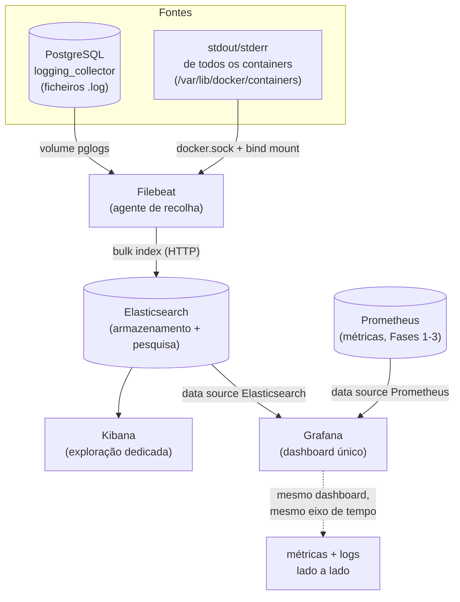

# Fase 4 — Conceitos técnicos e teóricos

Este documento explica os conceitos por trás das ferramentas e decisões da Fase 4, complementando o "como fazer" em [fase4-resumo.md](fase4-resumo.md). Ver também [fase3-conceitos.md](fase3-conceitos.md) — em particular a secção sobre depuração em camadas — para uma disciplina de troubleshooting reutilizada nesta fase.

---

## 1. Arquitetura da stack de logs — quem faz o quê, e como se encaixa no resto da solução

Até à Fase 3, a solução tinha um único "pilar" da observabilidade coberto: **métricas** (Prometheus a fazer scrape de exporters, Grafana a visualizar). A Fase 4 acrescenta o segundo pilar, **logs**, através de três ferramentas com responsabilidades estritamente separadas:

- **Filebeat** — o *agente de recolha* ("shipper"). Não guarda nada de forma permanente, não indexa, não pesquisa. A sua única função é ler ficheiros de log (ou streams) na origem, aplicar transformações leves (parsing multiline, adicionar campos), e **enviar** cada entrada para um destino. É o equivalente, no mundo dos logs, ao que o `postgres_exporter`/`mongodb_exporter` são no mundo das métricas: um tradutor entre "formato nativo da fonte" e "formato que a ferramenta central entende".
- **Elasticsearch** — o *motor de armazenamento e pesquisa*. Recebe os documentos JSON que o Filebeat envia, indexa-os (constrói estruturas de dados que tornam a pesquisa por texto/campos rápida, mesmo com milhões de documentos), e responde a queries. É o equivalente ao Prometheus nesta analogia — a base de dados especializada que guarda a série/o documento e responde a perguntas sobre eles — mas otimizado para texto livre e pesquisa, não para séries temporais numéricas.
- **Kibana** — a *interface de exploração*, especializada em navegar pelos dados do Elasticsearch (Discover, criar data views, dashboards nativos do Kibana). É o equivalente, para logs, ao que o **Grafana Explore** é para métricas Prometheus.

**Como se encaixam no resto da solução (o "porquê" desta fase):** o Grafana, que já servia como o ecrã único para métricas desde a Fase 3, ganha nesta fase um **segundo data source** (Elasticsearch, ao lado do Prometheus já existente) — permitindo colocar um painel de **logs** ao lado dos painéis de **métricas**, no mesmo dashboard, com o mesmo eixo de tempo. Isto é o que torna possível a "história de correlação" (Passo 6.3): ver um mergulho no gráfico de commits/s e, no mesmo instante, a query lenta que o causou, sem sair do ecrã. Kibana e Grafana não competem — o Kibana é a ferramenta certa para *explorar e depurar* logs em detalhe (pesquisa avançada, campos, histogramas), o Grafana é a ferramenta certa para *correlacionar* esse sinal com outras fontes (métricas, e mais tarde, traces).

## 2. ECS (Elastic Common Schema) e o conflito do campo `service`

O ecossistema Elastic define um **esquema comum de campos** (ECS) que todos os produtos Elastic (Beats, Logstash, o próprio Elasticsearch via templates automáticos) respeitam por convenção, para que logs de fontes diferentes tenham nomes de campo consistentes (`host.name`, `log.level`, `service.name`, etc.). Vários desses nomes são **reservados como objetos com subcampos**, não como valores simples — `service` é um deles (`service.name`, `service.type`, `service.id`, ...).

O erro encontrado (`object mapping for [service] tried to parse field [service] as object, but found a concrete value`) é uma consequência direta de tentar escrever um valor simples (`"postgresql"`) num campo que o template do Elasticsearch já definiu como objeto. Isto generaliza-se: **ao adicionar campos personalizados a uma ferramenta com um esquema fixo de terceiros, primeiro convém confirmar se o nome escolhido colide com um campo reservado** — a correção (`service` → `service.name`) não perde nenhuma funcionalidade, só alinha o campo com a estrutura que já é esperada.

## 3. `command:` no Docker Compose substitui, não acrescenta

Uma imagem Docker tem um `ENTRYPOINT` e um `CMD` por defeito, definidos no próprio Dockerfile. A imagem oficial do Filebeat usa esse `CMD` por defeito para incluir a flag `-e` (log para stderr, em vez do destino de ficheiro que é o padrão fora de containers). Ao definir `command: [...]` no `docker-compose.yml`, o Compose **substitui inteiramente** esse `CMD` — não o acrescenta.

É um erro fácil de cometer: a intenção era só adicionar `--strict.perms=false`, mas o efeito colateral foi perder a flag `-e` implícita, silenciosamente, sem nenhum erro visível — os logs simplesmente pararam de aparecer no sítio esperado (`docker logs`), sem indicação de que a causa era a definição do `command:`. **Regra geral:** ao sobrepor o `command:` de uma imagem de terceiros, vale a pena verificar a documentação/Dockerfile da imagem para ver que flags o comando por defeito já incluía, e replicá-las explicitamente.

## 4. `_id`, `_source` e a diferença entre "existir no documento" e "ser mostrado"

O painel de Logs do Grafana, inicialmente, mostrava o `_id` do documento Elasticsearch em vez do campo `message`. Isto ilustra uma distinção importante: o Elasticsearch guarda cada documento com um `_id` (identificador único, gerado automaticamente se não for especificado) e um `_source` (o JSON completo submetido, incluindo `message`, `@timestamp`, `service.name`, etc.). Uma query bem-sucedida devolve sempre o `_source` completo — o problema nunca foi os dados não estarem lá, mas sim o **Grafana não saber qual campo desse `_source` usar como "linha de log" a apresentar**.

Isto contrasta com o **Loki** (outra base de dados de logs, mais associada ao ecossistema Grafana), que impõe um modelo de dados fixo com um campo `line` sempre presente — daí o painel de Logs do Grafana "adivinhar" corretamente sem configuração extra quando a fonte é Loki. Com Elasticsearch, que não tem esse campo fixo, o Grafana precisa de ser instruído explicitamente (**data source → secção "Logs" → "Message field name"**) sobre qual campo do documento deve ser tratado como a linha de log a apresentar.

## 5. Data streams vs. índices clássicos — `setup.ilm.enabled: false` nem sempre é suficiente

Um **índice clássico** do Elasticsearch tem um nome fixo, escrito uma vez. Um **data stream** é uma abstração mais recente pensada para dados que chegam continuamente e ordenados no tempo (como logs): o nome que se vê (`db-logs-2026.08.26`) é, na realidade, um apontador para uma ou mais **"backing indices"** com nomes internos como `.ds-db-logs-2026.08.26-2026.08.26-000001`, geridas automaticamente (rotação, ILM).

O `filebeat.yml` desta fase define `setup.ilm.enabled: false`, na expectativa (documentada no próprio guia) de desativar este comportamento e usar índices simples com o nome literal do `output.elasticsearch.index`. Na prática, com a combinação de versões usada (Filebeat/Elasticsearch 8.13.4), os data streams continuaram a ser criados — o Filebeat 8.x tende a preferir o modelo de data stream por defeito, com a desativação do ILM a controlar apenas a *gestão do ciclo de vida*, não a escolha entre índice clássico e data stream. Para efeitos práticos de pesquisa (Kibana, Grafana), isto é indiferente — o index pattern `db-logs-*` continua a corresponder — mas é uma boa lição de que **uma opção de configuração pode não ter o efeito literal que o seu nome sugere numa versão específica de uma ferramenta**, e vale sempre a pena confirmar o resultado real (`_cat/indices`) em vez de confiar só na configuração escrita.

## 6. Health `yellow` num cluster de um só nó

O Elasticsearch reporta a saúde de um índice/cluster em três níveis: **green** (todos os shards, primários e réplicas, alocados), **yellow** (todos os primários alocados, mas pelo menos uma réplica não), **red** (pelo menos um primário não alocado — perda de dados iminente ou já em curso).

Num cluster de **um único nó** (como este lab, `discovery.type=single-node`), qualquer índice criado com o número de réplicas por defeito (1) nunca pode atingir `green`, porque não existe um segundo nó onde essas réplicas possam viver — ficam permanentemente `unassigned`. Isto é o estado **esperado e saudável** para este cenário, não um sintoma de problema; um lab a mostrar `yellow` está a funcionar como projetado. Só `red` (ou `yellow` com contagem de shards a crescer sem limite, sinal de outro problema) mereceria investigação.

## 7. "Dropping event" — o Filebeat não bloqueia à espera de retry infinito

Quando o Elasticsearch rejeita um documento com `status=400` (erro do próprio documento, não uma falha transitória de rede), o Filebeat regista um aviso e **descarta esse evento específico**, continuando a processar os seguintes — em vez de bloquear a pipeline inteira à espera que aquele documento particular seja aceite (o que nunca aconteceria, já que o erro era estrutural, não temporário). Isto é uma distinção importante em sistemas de recolha de logs: **erros transitórios** (rede em baixo, Elasticsearch a reiniciar) justificam retry com backoff; **erros estruturais** (mapeamento incompatível) não — repetir a mesma tentativa produziria sempre o mesmo erro, e o Filebeat reconhece isso ao descartar em vez de tentar indefinidamente.

O efeito secundário real encontrado aqui foi de **volume**: com todo o backlog de logs de containers a ser processado e rejeitado repetidamente antes da correção, geraram-se rapidamente decenas de MB de logs internos do próprio Filebeat (avisos de "dropping event") — motivo pelo qual a investigação exigiu limitar a pesquisa a `logging.selectors: ["elasticsearch"]` em vez de deixar o `debug` genérico inundar ainda mais os logs.

## 8. `docker.sock` e o input `container` — enriquecimento vs. simples leitura de ficheiro

O input `type: container` do Filebeat lê os mesmos ficheiros `*-json.log` que o Docker já escreve para cada container (o *log driver* `json-file`, por defeito). Poderia fazer-se o mesmo com um `filestream` genérico apontado ao mesmo caminho — a diferença do input `container` é que ele **sabe interpretar o formato JSON específico do Docker** (separar `log`, `stream`, `time` automaticamente) e, quando tem acesso ao `/var/run/docker.sock` (montado neste `docker-compose.yml`), pode consultar a API do Docker para **enriquecer** cada entrada com metadados que não estão no próprio ficheiro de log — nome do container, labels, imagem. É esse enriquecimento que torna possível a pesquisa `container.name : "lab-grafana"` no Kibana, um campo que não existe no ficheiro de log em si, mas que o Filebeat adiciona a partir do socket do Docker.

## 9. `vm.max_map_count` — por que o Elasticsearch precisa de tantos memory maps

O Elasticsearch (via Lucene, o motor de indexação por trás dele) representa cada segmento do índice como vários ficheiros mapeados em memória (`mmap`) para acesso rápido, em vez de leituras de disco tradicionais a cada pesquisa. Com muitos índices/shards (recorda-se: 31 shards ativos só nesta fase, entre os índices de sistema do Kibana e os `db-logs-*`), o número total de regiões de memória mapeada facilmente excede o limite por defeito do kernel Linux (`vm.max_map_count`, tipicamente 65530 nas VMs do Docker Desktop). Sem o ajuste para 262144, o Elasticsearch falha explicitamente no arranque em vez de degradar silenciosamente — é uma verificação de arranque ("bootstrap check") deliberada, para evitar comportamento instável sob carga.

## 10. O valor da correlação: por que este é "o argumento de venda" da fase

Antes desta fase, um mergulho no gráfico de commits/s (Painel 2 do dashboard, Fase 3) só permitia *especular* sobre a causa. Depois desta fase, o mesmo mergulho, visto ao lado do painel de logs filtrado por `message : *duration*`, permite **confirmar a causa no mesmo ecrã, sem trocar de ferramenta**: se uma query lenta aparece exatamente no mesmo instante do mergulho, a correlação está estabelecida sem inferência. Esta é a demonstração prática do valor de juntar dois dos três pilares clássicos da observabilidade (**métricas** + **logs**) numa única superfície de visualização — o terceiro pilar (**traces**, ligando uma requisição específica da API a todo o seu percurso pelas bases de dados) é o que a Fase 5 introduz.

---

**Ver também:** [fase4-resumo.md](fase4-resumo.md) — comandos, resultados e troubleshooting real desta fase.
